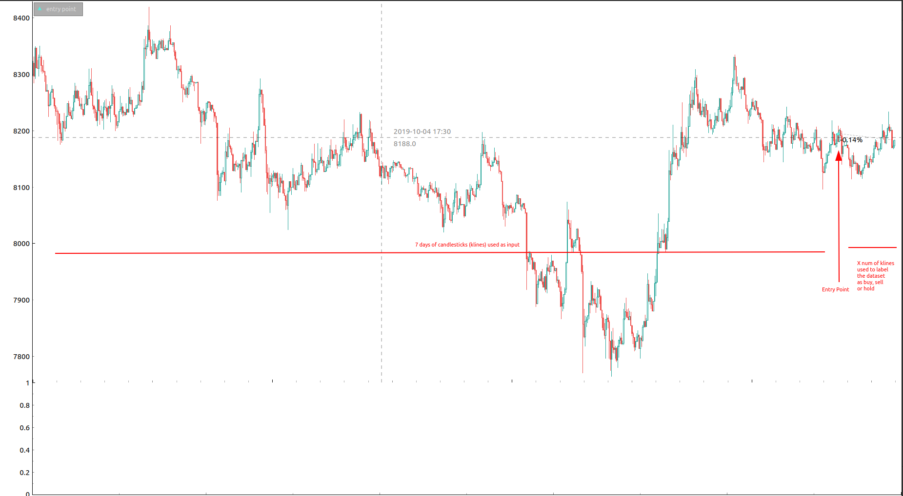

# ToTheMoon

# State...
- Creating initial database. (4704870) trades recorded from pre.
- Need to keep DB table Klines as well as Trades

Get the bot to start making trades
Created pytorch nn
Need to 
Add feature: vPoC, vwap, averages, high, min, avg

# DB
### Trade
- Trades table created using peewee.
- hosted on AWS RDS
- loaded 7 days of trades, AWS EC2 will subscribe to ByBit API, and keep my DB updated with all recent trades.

### Kline
- I also need to do this for klines ***important***

### BotPosition
- the positions my bot has gone into. Buy/sell. at what price? loss/gain.

# How the bot will work:
- Bot will every 5 min: check 7 trailing days of trades and klines and form data to feed to Neural Network.
- If the NN predicts buy, sell, use ByBit API to enter that position
- Record BotPositions into DB

# NN Features:

# Creating NN:
1. Fetch data points (klines) using python script and Bybit.com api
2. Format the data for NN
I think the dataset format looks something like this:
- the past 7 days of 15 minutes klines:
    (open, close, high, low, ...)
- other stats over all those klines we collected (high, avg, low, ...)
- POC (point of control)
- y is 0 1 or 2

- each dataset was labeled 0 1 or 2 (buy sell or hold) buy looking at the next X number of klines after, and if 
the price movement was at last ~1%? in either direction it would be (buy/sell) otherwise 2 for hold.

Here is a plot of an example data set:

3. Use pytorch to learn params

output is 0 1 and 2? buy sell or hold.

### Creating Point of Control data point
1. Needed to fetch all trades for the time frames I wanted to create data sets for
2. Sift through trades to calculate Point of Control (the price at which most volumes were traded for a given period)
